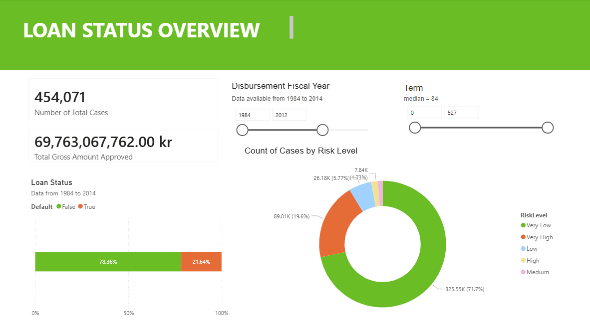

# Loan Default Analysis
## Introduction
The goal of the project is to improve the efficiency of approving loans for banks using data driven strategies. Machine learning method is used to identify the key drivers of loan default. Following the results obtained from the model, each case is assigned a probability of default, which is later used to segment all cases into five risk levels. The results are presented in an interactive Power BI dashboard. 

## Data 
The data is obtain from [kaggle](https://www.kaggle.com/datasets/mirbektoktogaraev/should-this-loan-be-approved-or-denied?resource=download). The data contains historical loan default data between 1984 and 2014. Necessary data cleaning (e.g., converting the data type to correct format, remove missing values that are difficult to impute) is conducted prior to the analysis.

## Insights
* Cases labeled high risk and very high risk made up 21% of the cases and they are likely to account for a disproportionate amount of the bank’s potential capital loss.
* Terms is a powerful variable (accounts for 44% of the variable importance in a random forest model), which suggests that long-term exposure significantly increases uncertainty regardless of the borrower's initial health.
* Default risk is cyclical, driven by the year of approval (macroeconomic climate) and the maturity of the business (operational risk), rather than specific industry volatility.
* Both internal factors (if the business was new) and external factors (the year when the loan was approved) are important indicators for possible loan default.
* Higher guaranty rate (def., the loss will be covered by an external organization, in this case, Small Business Administration (SBA)), does not reduce the probability of default. This suggests that the presence of a safety net may lead to looser credit standards or riskier borrower behavior.

## Recommendations 
* Implement a "Risk-Based Pricing" Model: Use the five risk levels to adjust interest rates. Low-risk borrowers should receive competitive rates to ensure retention, while high-risk borrowers should be charged a premium to offset the 21% default probability.

* Dynamic Term Structuring: Since "Term" is the most powerful predictor, the bank should incentivize shorter loan durations for "New Businesses" or during volatile "Approval Years" through discounted processing fees or lower rates on 12–24 month products.

* Automated "Fast-Track" for Low-Risk Segments: Use the Power BI dashboard to identify the "Very Low Risk" segment (the bottom 20–30%) and implement an automated approval process. This reduces the manual workload for credit officers, allowing them to focus their expertise on the complex "Medium Risk" cases.

* Sector-Agnostic Credit Expansion: Since the data shows default has "less to do with industry," the bank can diversify its portfolio by lending to underserved sectors without significantly increasing risk, provided the "Term" and "Business Age" metrics are healthy. However, this approach should be actively updated according to the newest trends in state policy. 

* Early Warning System (EWS): Integrate the Random Forest model into the bank's customer relationship management system. If a borrower’s external factors (e.g., macro-economic indicators of the current year) shift, the system should flag "At-Risk" accounts for proactive restructuring before they reach the "Very High Risk" stage.

